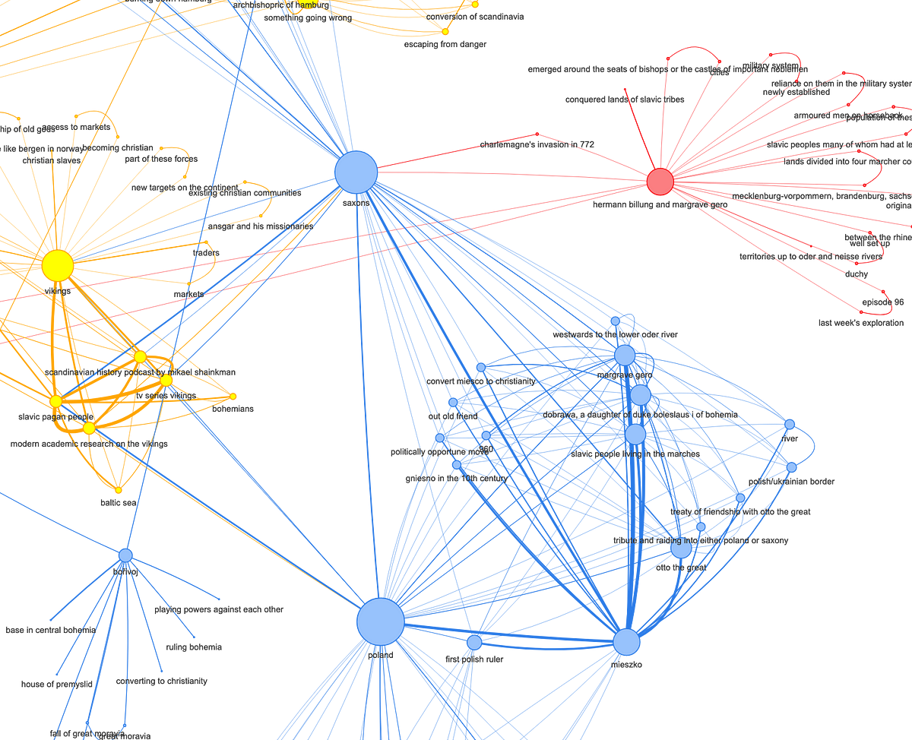

# <> 2. Embeddings
What is embedding?

It's a way to turn token IDs into vectors of real numbers that capture meaning.

The model has an embedding table:

 - Rows = tokens (like 30,000 total)

 - Columns = dimensions (like 768 or **2 in our toy example**)

```python
[ vocabulary_size, embedding_dim ]

Embedding Table = [30,000 × 768]
```

Example:

If token ID 42 = "love", the model finds the 42nd row in this table:

```python
Embedding of "love" = embedding_table[42] = [0.12, -0.56, ..., 0.07]  (length = 768)
```

<br>

Each token ID maps to a vector **(In our exmaple we only have length = 2)**.


| Token ID | Word   | Embedding |
| -------- | ------ | --------- |
| 101      | "I"    | \[1, 0]   |
| 102      | "love" | \[0, 1]   |
| 103      | "AI"   | \[1, 1]   |


### **These numbers start random and are learned during training so that similar words get similar vectors.**

| Stage           | Are Embeddings Random? | Description                        |
| --------------- | ---------------------- | ---------------------------------- |
| Before training | ✅ Yes                  | Randomly initialized               |
| During training | 🔄 Updating            | Learned by minimizing model loss   |
| After training  | ❌ No                   | Meaningful, task-optimized vectors |

But during training, the model updates these vectors (using backpropagation) so that:

**Similar words (like "cat" and "kitten") move closer together.**

Words used in similar contexts get similar vectors.

<br>


## How Does It Work?
Imagine this:

 - You have a vocabulary of, say, 30,000 tokens (like GPT or BERT).

 - You want each token to be represented by a vector of 768 numbers (common in large models).

So, you create a matrix of shape:

| Token ID | Embedding Vector (initially random) |
| -------- | ----------------------------------- |
| 101      | \[0.15, -0.32, 0.67, ..., 0.04]     |
| 102      | \[-0.12, 0.21, -0.98, ..., -0.50]   |
| ...      | ...                                 |




## Why Choose a Certain embedding_dim?
 - Higher embedding_dim → captures more nuanced meaning, but increases:
   - Memory usage
   - Model size
   - Risk of overfitting (if too high and data is limited)
 - Lower embedding_dim → more efficient, but may lack expressiveness.

In practice, you want the embedding_dim to match the hidden size of your transformer layers for compatibility.


