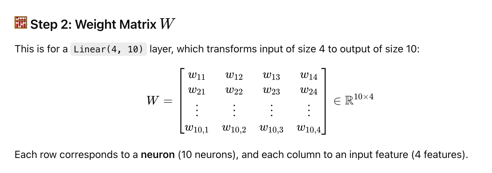

Think of it like building machines:

 - FFNN, CNN, RNN → engines or model types

 - GAN, Transformer, Autoencoder → systems/frameworks that use those engines in specific arrangements


# A Feedforward Neural Network is the simplest type of artificial neural network:

Key Features:
 - Data flows in one direction → from input → to hidden layers → to output.

 - No loops or cycles.

 - Often used in basic tasks like classification or regression.

```python
Input → Hidden Layer → Output

output = activation(weights * input + bias)
```

<br><br>

# Full Breakdown of a Feedforward Neural Network (FNN)

<br><br><br>

## 1. Definition & 2. Main Components

### A Feedforward Neural Network (FFN) is the most basic type of neural network where:

 - Information flows only forward from the input to the output.

 - There are no cycles or feedback connections.

<br>

### An FFN consists of:

 - Input Layer

 - One or more Hidden Layers

 - Output Layer

 - Weights and Biases

 - Activation Functions

```python
import torch.nn as nn

class FFNN(nn.Module):
    def __init__(self, input_dim):
        super(FFNN, self).__init__()
        self.model = nn.Sequential(
            nn.Linear(input_dim, 128), # Input Layer
            nn.ReLU(),
            nn.Dropout(0.3),
            nn.Linear(128, 64), #Hidden Layer
            nn.ReLU(),
            nn.Dropout(0.3),
            nn.Linear(64, 1), # Hidden Layer
            nn.Sigmoid()
        )

    def forward(self, x):
        return self.model(x)
```

 - <span style="background-color: #ffff00"> Input layer size: input_dim (depends on your input features) (input_dim = 3 in our example)</span>
   
   - The 3 input features (say: [HR, BP, Age]) these are the input features you want it to learn from

 - <span style="background-color: #ffff00"> Two hidden layers: 128 units and 64 units, both followed by ReLU activations and dropout (0.3) </span>

 - <span style="background-color: #ffff00"> Output layer: 1 unit with Sigmoid (so this is good for binary classification)</span>


<br><br>

 - So nn.Linear(3,128) in our example takes our (n is dependent on our batch size) (n,3)*(3,128)T (128,3 before transpose) to create a matrix of (n,128) (say batch size 1 then (1,128))

 ```python
import torch
import torch.nn as nn

# Define a linear layer: maps 3 input features to 128 output features
linear_layer = nn.Linear(in_features=3, out_features=128)

# Example input: batch of 1 samples, each with 3 features
input_tensor = torch.randn(1, 3)  # Shape: (batch_size=1, in_features=3)

# Forward pass
output = linear_layer(input_tensor)
print(output.shape)  # Output: torch.Size([1, 128])
```


<br><br><br><br>


## 3. Input Layer

 - Accepts input features from the dataset.

 - Each neuron represents a feature.

 - Example: For 3 input features [x1, x2, x3], the input layer has 3 neurons.

```python
input_dim = 3 (3 features)

Batch size = 2 (2 samples)


X = [ #Two samples (rows)
  0.5  -1.0  2.0  #3 three features (columns)
  1.0  0.0  -0.5
]
```


<br><br><br><br>


## 4. Weights and Biases

 - Each connection between neurons has a weight (w) and bias (b).

 - These are the parameters the network learns.

 - **Initially, weights and biases are usually randomly initialized.**

### <span style="background-color: #ffff00"> If you increase the number of neurons in a layer (say, from 128 → 512), you increase the number of output units (the more weights you can test).

### <span style="background-color: #ffff00"> That increases the number of rows in the weight matrix, so more random weights are initialized.


### **More neurons → bigger weight matrix → more parameters to learn → more random weights at the beginning.**


<br><br><br><br>

## 5. Linear Transformation

 - Each neuron performs a weighted sum:


```python
z = w₁·x₁ + w₂·x₂ + ... + wₙ·xₙ + b
```
Or in vector notation:

```python
z = W·x + b
```


Where:

 - W = weight matrix

 - x = input vector

 - b = bias vector


<br>


### Since 128 is big, let's do a tiny FFNN:

 - Input: 3 features

 - <span style="background-color: #ffff00"> Hidden layer: 2 neurons

 - Output: 1 unit


```python

X = [
    [0.5, -1.0, 2.0],
    [1.0, 0.0, -0.5]
]


W_1 = [
    [0.1, 0.3, 0.5],
    [-0.2, -0.4, -0.6]
]


#Bias for first layer 
b_1 = [0.1, −0.1]

```
### <span style="background-color: #ffff00"> If your first hidden layer has 128 units and your input has input_dim features, then the weight matrix W_1 of the first linear layer will have shape: </span>
###    -------------------------    [batch_size,128] (later it will get transposed)

<br>

 - Rows correspond to the number of output neurons in the layer (here 128).

 - Columns correspond to the number of input features (input_dim).

I.e. if it was 128 each batch of two with three featues would get matrix muliplied with **(2,3)*(128,3)T + b**

<br>

This shows small weights of (2*3)


<br><br>


### 5.1 Example of baze 3 and neurons 10

Setup

 - Batch size = 3

 - Input dim = 4

 - Hidden layer neurons = 10




<br><br><br><br>


## 6. Activation Function
 - Applies a non-linear transformation to the output of each neuron:

```python
a = activation(z)
```

Common activations:

 - ReLU (max(0, x))

 - Sigmoid (for binary outputs)

 - Tanh

 - Softmax (for probabilities in multi-class outputs)


<br><br><br><br>


## 7. Hidden Layers
 - Layers between input and output.

 - Each neuron in a hidden layer connects to all neurons in the previous layer.

 - Purpose: To learn complex patterns in the data.


<br><br><br><br>


## 8. Output Layer

 - Final predictions of the network.

 - Output depends on the task:

   - Regression: Linear or no activation

   - Binary classification: Sigmoid activation

   - Multi-class classification: Softmax activation


<br><br><br><br>


## 9. Forward Propagation
This is the core "feedforward" part:

 - Input passes through layers using:

```python
a = activation(W·x + b)
```

### How it fits in:

In a fully connected neural network:

```python
Input → [Linear Layer] → [Activation Layer] → [Linear Layer] → ... → Output
```

```python
nn.Linear(4, 10),  # Linear layer (has weights and bias)
nn.ReLU(),         # Activation layer (no weights)
```

### Common Activation Functions
| Function  | Behavior                                          |
| --------- | ------------------------------------------------- |
| `ReLU`    | $\max(0, x)$ — most common, fast and sparse       |
| `Sigmoid` | Squashes to (0, 1) — used for binary output       |
| `Tanh`    | Squashes to (-1, 1) — smoother but more expensive |
| `Softmax` | Converts vector to probability distribution       |


<br><br><br><br>


##  10. Loss Function
 - Measures how far predictions are from actual targets.

 - Examples:

   - Mean Squared Error (MSE) → regression

   - Cross-Entropy Loss → classification


* Final predictions:

  $$
  \hat{y} =
  \begin{bmatrix}
  0.7037 \\
  0.5585
  \end{bmatrix}
  $$

* True labels:
  Let’s assume:

  $$
  y =
  \begin{bmatrix}
  1 \\
  0
  \end{bmatrix}
  $$

---

$$
\mathcal{L} = -\frac{1}{N} \sum_{i=1}^{N} \left[ y_i \log(\hat{y}_i) + (1 - y_i) \log(1 - \hat{y}_i) \right]
$$

Plug in:

$$
\mathcal{L} = -\frac{1}{2} \left[1 \cdot \log(0.7037) + (1 - 1) \cdot \log(1 - 0.7037)+ 0 \cdot \log(0.5585) + (1 - 0) \cdot \log(1 - 0.5585)\right]
$$

$$
= -\frac{1}{2} \left[
\log(0.7037) + \log(1 - 0.5585)
\right]
\approx -\frac{1}{2} \left[
-0.3517 + (-0.8211)
\right]
= \frac{1}{2}(1.1728)
= 0.5864
$$


<br><br><br><br>


##  11. Backpropagation

 - Computes gradients of loss w.r.t. each weight and bias using chain rule of calculus.

 - Efficiently updates all layers from output back to input.


---

### 🔙 Goal:

We want gradients of the **loss w\.r.t. each weight** so we can **update them**:

* $\frac{\partial \mathcal{L}}{\partial W_2}$
* $\frac{\partial \mathcal{L}}{\partial b_2}$
* $\frac{\partial \mathcal{L}}{\partial W_1}$
* $\frac{\partial \mathcal{L}}{\partial b_1}$

---

### Step-by-Step Sketch:

1. **From loss → output**

   $$
   \frac{\partial \mathcal{L}}{\partial \hat{y}} = \left[ -\frac{y}{\hat{y}} + \frac{1 - y}{1 - \hat{y}} \right]
   $$

2. **Through sigmoid**

   $$
   \frac{d\hat{y}}{dz_2} = \hat{y}(1 - \hat{y})
   $$

3. **To compute $\delta_2$**

   $$
   \delta_2 = \frac{\partial \mathcal{L}}{\partial z_2} = (\hat{y} - y)
   $$

This is a known simplification for binary cross-entropy with sigmoid.

---

So (AS WE ARE USING REGRESSION AND THERE ARE ONLY TWO ANSWER 1 OR 0):

$$
\delta_2 = \hat{y} - y =
\begin{bmatrix}
0.7037 - 1 \\
0.5585 - 0
\end{bmatrix}
=
\begin{bmatrix}
-0.2963 \\
0.5585
\end{bmatrix}
$$

---


$$
\frac{\partial \mathcal{L}}{\partial W_2} = A_1^\top \cdot \delta_2
$$

We transpose $A_1$ to get shape (2, 2):

$$
A_1^\top =
\begin{bmatrix}
0.95 & 0.05 \\
0 & 0
\end{bmatrix}
$$

Now multiply:

$$
\frac{\partial \mathcal{L}}{\partial W_2} =
\begin{bmatrix}
0.95 & 0.05 \\
0 & 0
\end{bmatrix}
\cdot
\begin{bmatrix}
-0.2963 \\
0.5585
\end{bmatrix}
$$

Matrix multiplication:

* First element: $0.95 \cdot -0.2963 + 0.05 \cdot 0.5585 = -0.2815 + 0.0279 \approx -0.2536$
* Second element: $0 \cdot -0.2963 + 0 \cdot 0.5585 = 0$

$$
\frac{\partial \mathcal{L}}{\partial W_2} \approx
\begin{bmatrix}
-0.2536 \\
0
\end{bmatrix}
$$

---


<br><br><br><br>

## 12. Optimization (Gradient Descent)

 - After computing gradients, update weights:

```python
w := w - learning_rate × ∂loss/∂w
b := b - learning_rate × ∂loss/∂b
```

 - Optimizers: SGD, Adam, RMSprop, etc.

Assume learning rate $\eta = 0.1$

Original weights:

$$
W_2 =
\begin{bmatrix}
0.7 \\
-0.3
\end{bmatrix}
$$

Update rule:

$$
W_2 := W_2 - \eta \cdot \frac{\partial \mathcal{L}}{\partial W_2}
$$

$$
W_2 := \begin{bmatrix} 0.7 \\ -0.3 \end{bmatrix} - 0.1 \cdot \begin{bmatrix} -0.2536 \\ 0 \end{bmatrix} = \begin{bmatrix} 0.7 + 0.02536 \\
-0.3
\end{bmatrix}
=
\begin{bmatrix}
0.7254 \\
-0.3
\end{bmatrix}
$$

---


<br><br><br><br>


## 13. Training Loop
 - This process repeats over many epochs:

 - Feed input through the network

 - Compute loss

 - Backpropagate error

 - Update weights

 - Repeat on all batches


## Advantages
 - Simple and fast to implement

 - Good for structured/tabular data

 - Works well on small to medium-sized problems


## Limitations

 - Cannot model sequences or time-dependent data

 - Requires large data for deeper networks

 - Struggles with spatial or temporal data (e.g., images, audio, text)

## Variants of FFNs
 - Other types of neural networks:

 - Convolutional Neural Networks (CNNs) → image data

 - Recurrent Neural Networks (RNNs) → sequential data

 - Transformers → attention-based, for NLP

 - Autoencoders → unsupervised representation learning
