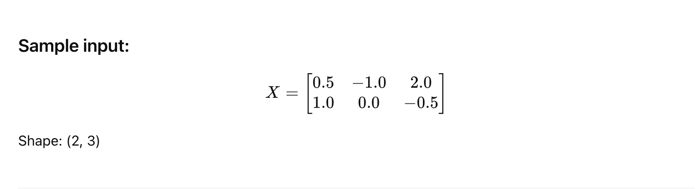
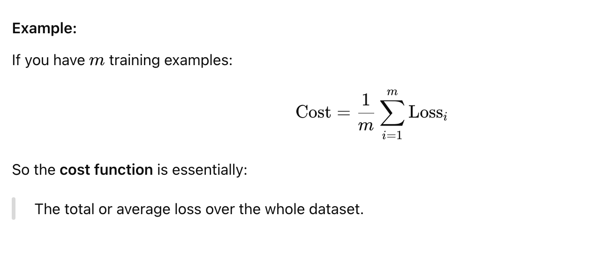

## 1. What Is a Loss Function?

A loss function measures the difference between the model's predicted
    output and the actual target (label). The smaller the loss, the better the model is doing.

 - Definition: The loss function measures the error for a single training example.

 - Purpose: It quantifies how far off a model's prediction is from the actual label.




## 2. What is a Cost Function?

 - Definition: The cost function is the average of the loss function across all training examples.

 - Purpose: It gives an overall measure of how well the model is performing on the entire dataset.




<br><br>


| Example | Prediction | Actual | Loss |
| ------- | ---------- | ------ | ---- |
| 1       | 0.9        | 1      | 0.01 |
| 2       | 0.2        | 0      | 0.04 |
| 3       | 0.7        | 1      | 0.09 |


Then:

Loss for Example 1 = 0.01 (individual)

Cost = Average of all 3 = (0.01+0.04+0.09) / 3 = 0.0467


<br><br><br><br>


## 1. Feedforward Neural Networks (FFN)
Use Case: Classification or regression (e.g., image classification, tabular data)

 - Loss computed: Once per example

 - Typical Loss Functions:

   - Classification: Cross-Entropy Loss
   - Regression: Mean Squared Error (MSE)


```python
# Classification Example
criterion = nn.CrossEntropyLoss()
loss = criterion(output, target)
```

<br><br><br><br>

## 2. Recurrent Neural Networks (RNN / LSTM / GRU)
Use Case: Sequence modeling (e.g., language modeling, time series)

 - Loss computed: At each time step in a sequence

 - Loss aggregated: By summing or averaging over time steps


```python
# Assume outputs and targets are shape [seq_len, batch_size, vocab_size]
loss = 0
for t in range(seq_len):
    loss += criterion(output[t], target[t])
loss /= seq_len
```

<br><br><br><br>


## 3. Convolutional Neural Networks (CNN)

Use Case: Images, spatial data (e.g., image classification, object detection)

 - Loss computed: Per output image or feature map

 - Same loss functions as FFNs:

   - Classification: Cross-Entropy

   - Detection/segmentation: custom losses (e.g., IoU, Dice loss)

```python
criterion = nn.CrossEntropyLoss()
loss = criterion(predicted_logits, labels)
```

<br><br><br><br>

## 4. Transformer / Attention Models (LLMs)

Use Case: Text generation, translation, summarization

 - Loss computed: At each token position

 - Usually Cross-Entropy across vocabulary

```python
# Shape: [batch_size, seq_len, vocab_size]
loss = criterion(output.view(-1, vocab_size), target.view(-1))
```


<br><br><br><br>


## 5. Autoencoders
Use Case: Dimensionality reduction, denoising, anomaly detection

 - Loss computed: Between input and reconstruction

 - Loss functions:

   - MSE for reconstruction

   - Binary Cross-Entropy for binary inputs

```python
# Reconstruction loss
loss = F.mse_loss(reconstructed, original_input)
```


<br><br><br><br>


## 6. Generative Adversarial Networks (GANs)

Use Case: Image generation, data synthesis

 - Two losses:

   - Generator loss

   - Discriminator loss

 - Usually Binary Cross-Entropy or Wasserstein loss


```python
# Discriminator
d_loss_real = criterion(D(real_data), torch.ones_like(label))
d_loss_fake = criterion(D(fake_data), torch.zeros_like(label))

# Generator
g_loss = criterion(D(fake_data), torch.ones_like(label))
```


<br><br><br><br>


| Network Type      | Typical Loss Function           | Applied At                  | Special Notes                         |
| ----------------- | ------------------------------- | --------------------------- | ------------------------------------- |
| FFN               | MSE / Cross-Entropy             | Once per input              | Standard networks                     |
| CNN               | MSE / Cross-Entropy / IoU       | Once per image/region       | Often paired with spatial ops         |
| RNN / LSTM / GRU  | Cross-Entropy / MSE             | Per time step               | Loss summed or averaged over sequence |
| Transformer / LLM | Cross-Entropy                   | Per token                   | Softmax over vocabulary               |
| Autoencoder       | MSE / BCE                       | Per input vs reconstruction | Unsupervised use                      |
| GAN               | BCE / Wasserstein               | Discriminator + Generator   | Two opposing loss functions           |
| RL (DQN, PPO)     | TD Error / Policy Gradient Loss | Per action/state            | Uses rewards from environment         |


